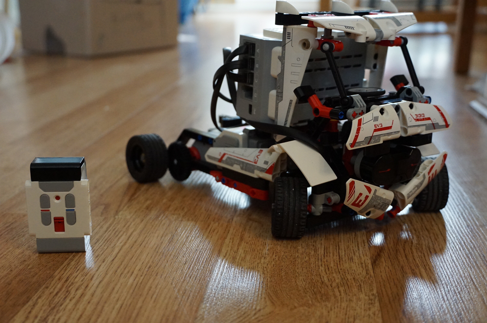
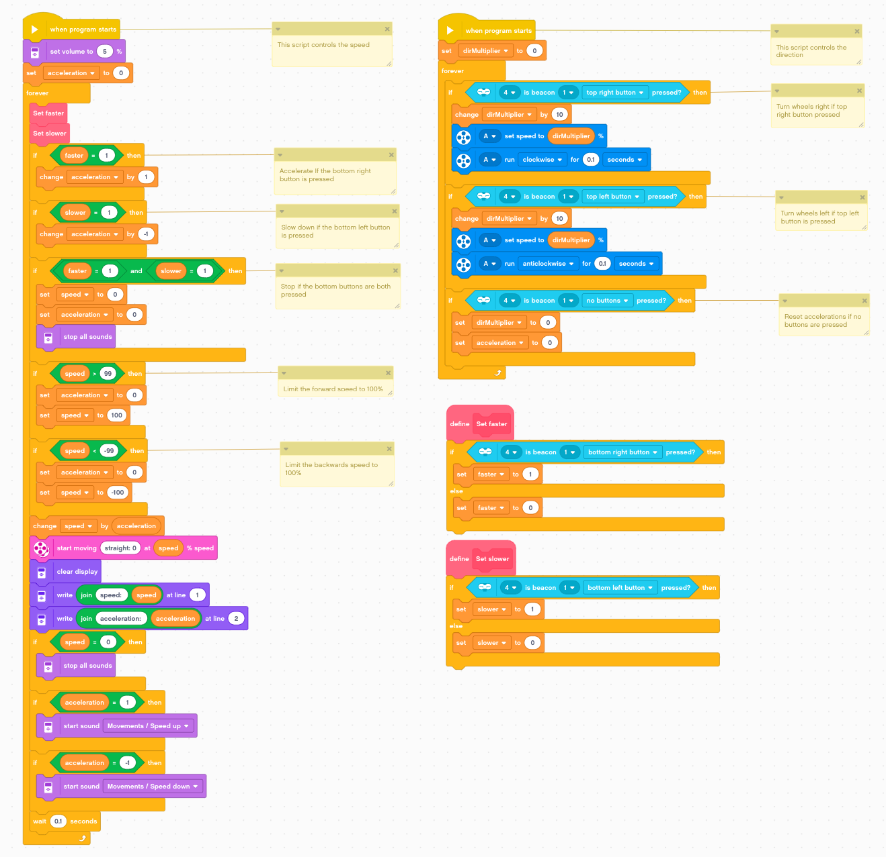

# EV3 Robots
These are EV3 programs developed with my children.

## Installation
- Open the Lego Mindstorms HOME application
- Use "File > Open File" menu to work on work on a program

## Programs:
### EV3 Game
A guessing game where a ball is hidden in a cup and shuffled by the robot. You make a guess, and the robots tells you wrong or right!

### EV3 Whack-Wham
A speed game where 3 moles pop-up at random and you must whack them as fast as possible with a hammer!

### EV3 Rolling About: Program for the RAC3R truck
This is a sample program from the RAC3R truck designed by Laurens Valk. See [Lego mindstorms fan robots](https://www.lego.com/en-us/themes/mindstorms/buildarobot) to download building instructions

| Photo | Program |
|---|---|
|||
